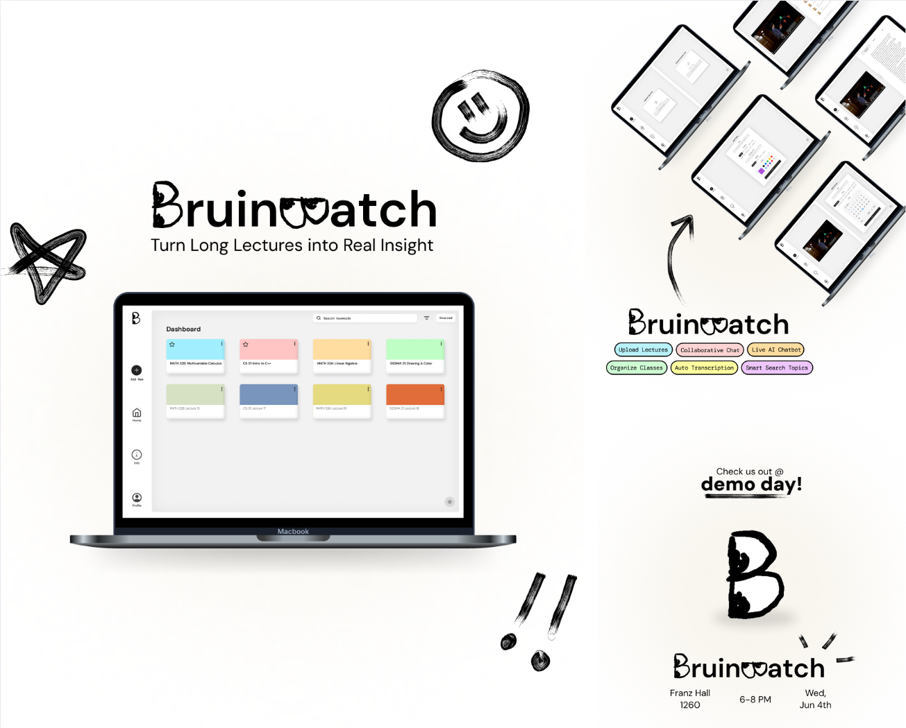

# BruinWatch

Turn your lecture videos into an AI-powered agent that you can chat with!




## Setup

Refer to '.env.example' and create a `.env` file in the `backend` directory.
<br>
Make sure your `.env` file is in `.gitignore`.
```bash
MONGODB_URI=your_mongodb_uri
JWT_SECRET=your_jwt_secret
AWS_ACCESS_KEY_ID=your_aws_access_key_id
AWS_SECRET_ACCESS_KEY=your_aws_secret_access_key
AWS_REGION=your_aws_region
S3_BUCKET=your_s3_bucket_name
OPENAI_API_KEY=your_openai_api_key
GOOGLE_CLIENT_ID=your_google_client_id
FRONTEND_URL=http://localhost:5173
```

Refer to '.env.example' and create a `.env` file in the `frontend` directory.
<br>
Make sure your `.env` file is in `.gitignore`.
```bash
VITE_BACKEND_URL=http://localhost:5000
VITE_GOOGLE_CLIENT_ID=your_google_client_id
```

### Frontend

```bash
cd frontend
npm install
npm install -D vite # if missing vite installation
npm run dev # start frontend
```
Go to http://localhost:3000/ to see the website.

### Backend

```bash
cd backend
npm install # npm install <dependency> for installing further dependencies
node app.js # start backend
```
Go to http://localhost:5000/ to see the backend API.
